# Diagram UML — SPK Pemilihan Karyawan Terbaik Bank BRI KCP Arundina
# Metode MOORA | Sistem Multi-Role: Administrator & Pimpinan

---

## 1. Use Case Diagram

Menggambarkan interaksi dua aktor (Administrator dan Pimpinan) dengan seluruh fitur sistem.

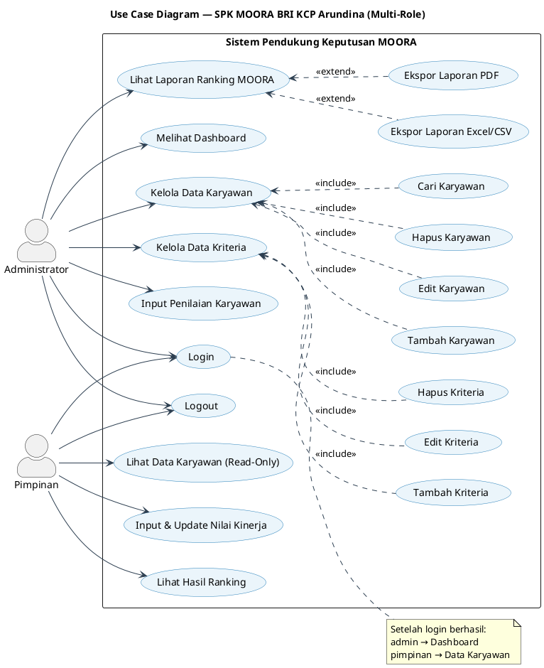

---

## 2. Activity Diagram — Login dengan Routing Role

Menggambarkan alur autentikasi dan routing berdasarkan role pengguna.

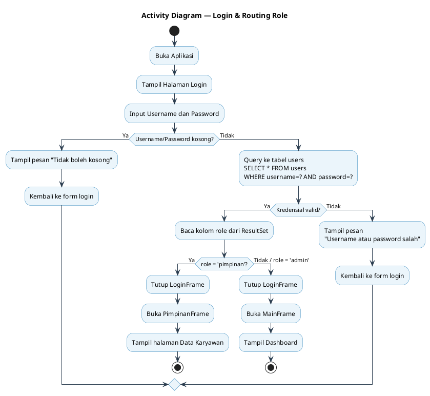

---

## 3. Activity Diagram — Kelola Data Karyawan (Admin)

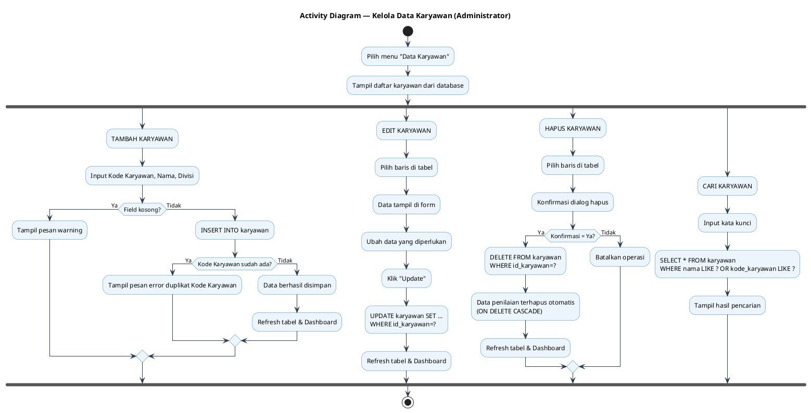

---

## 4. Activity Diagram — Input Penilaian (Admin & Pimpinan)

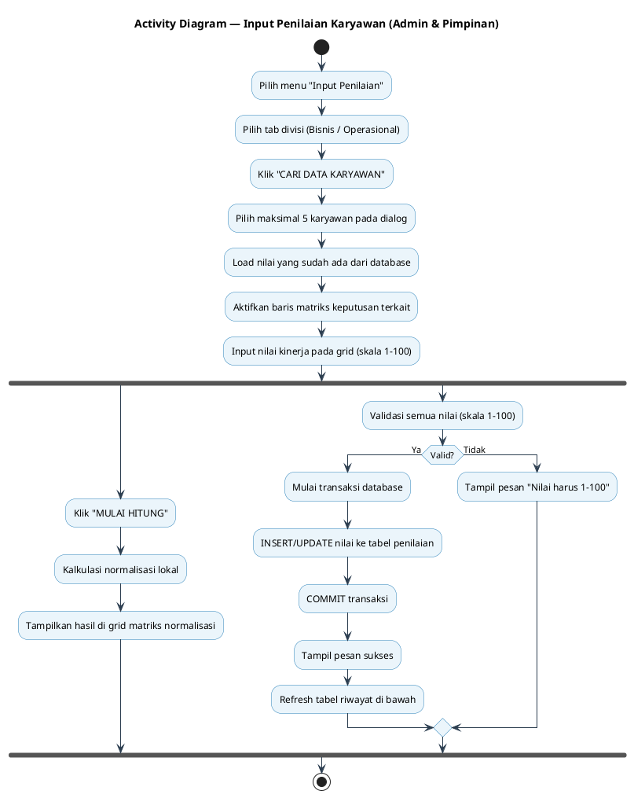

---

## 5. Activity Diagram — Kalkulasi MOORA & Laporan Ranking

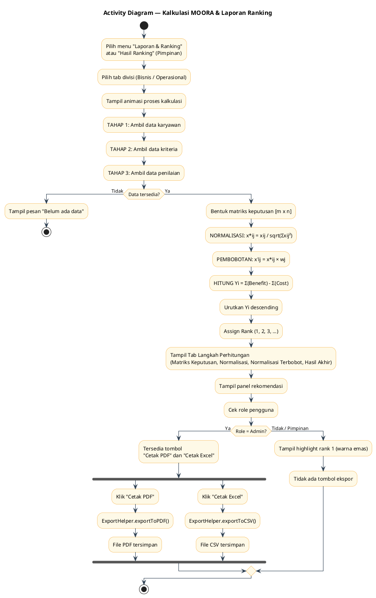

---

## 6. Sequence Diagram — Login dengan Routing Role

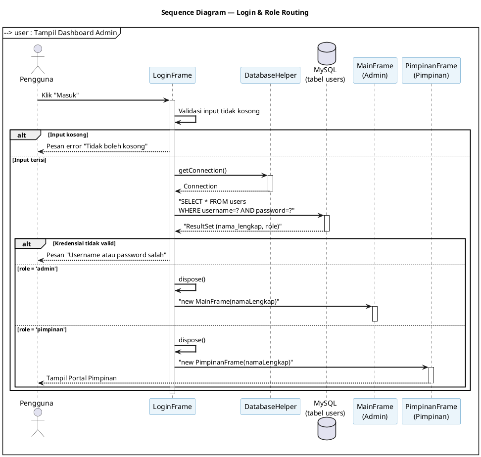

---

## 7. Sequence Diagram — Kalkulasi MOORA

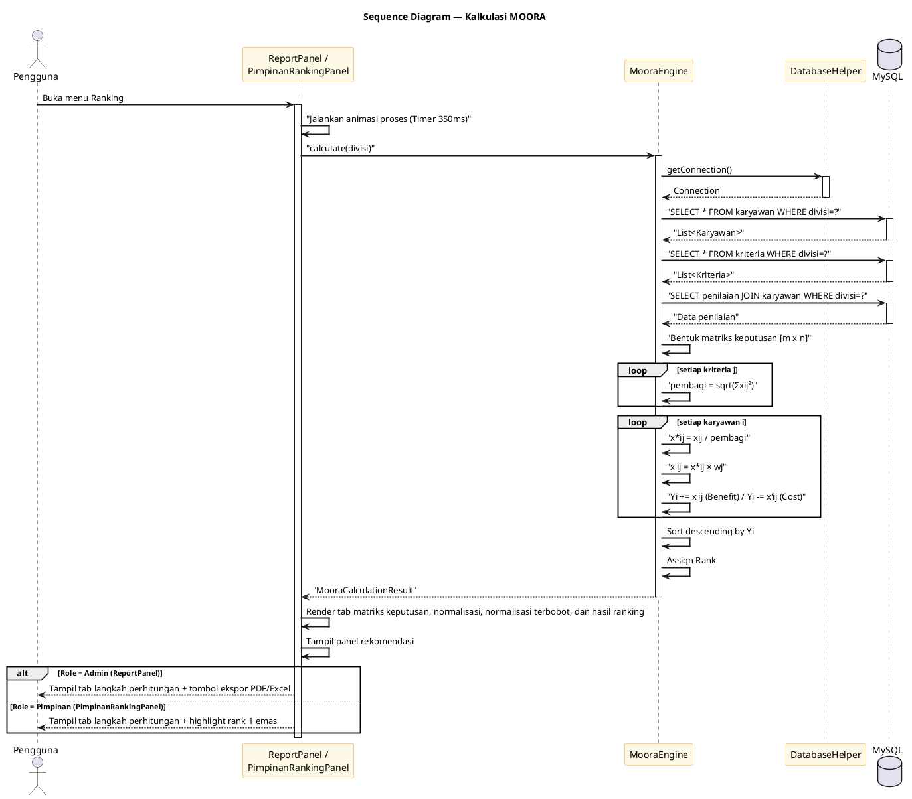

---

## 8. Sequence Diagram — Input Penilaian (Pimpinan)

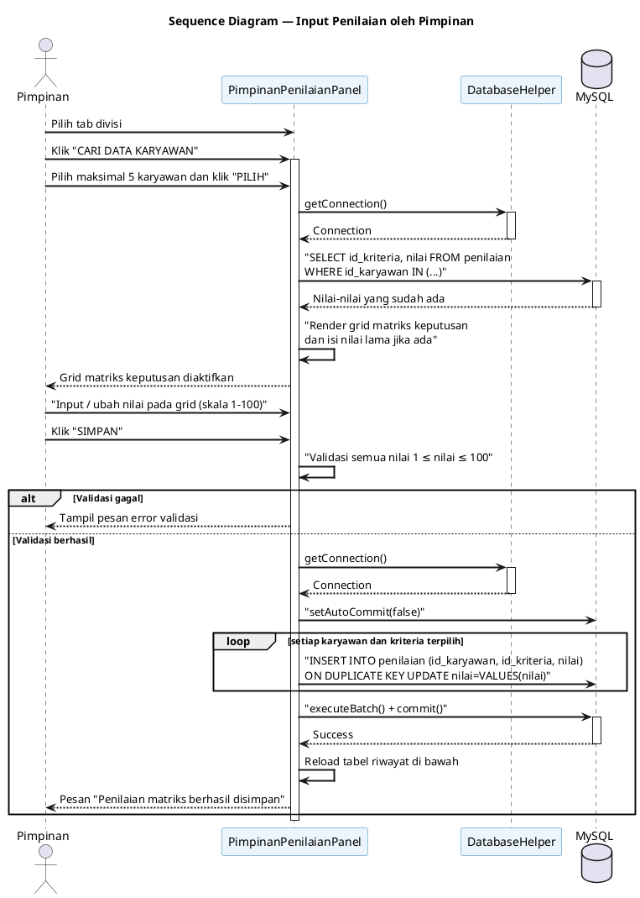

---

## 9. Class Diagram (Lengkap dengan Role)

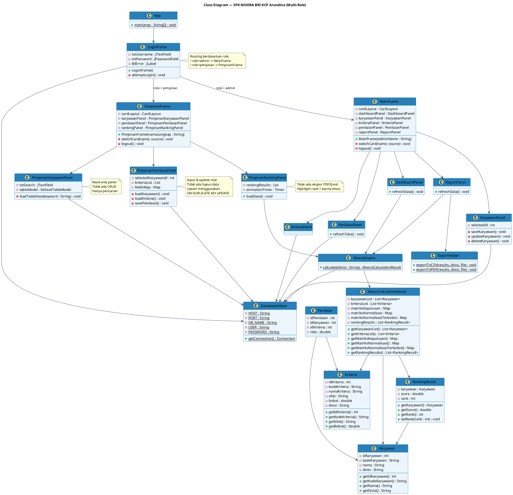

---

## 10. Entity Relationship Diagram (ERD)

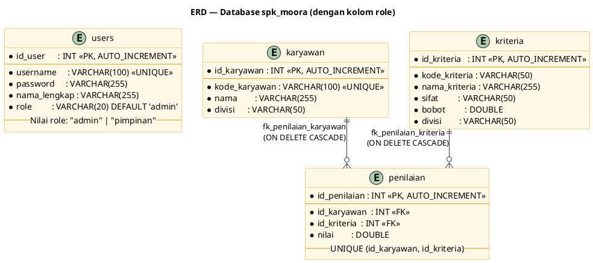

---

## 11. Deployment Diagram

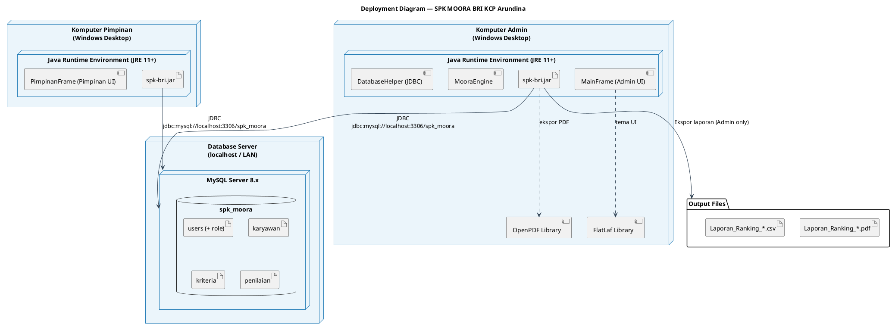

---

## 12. Component Diagram

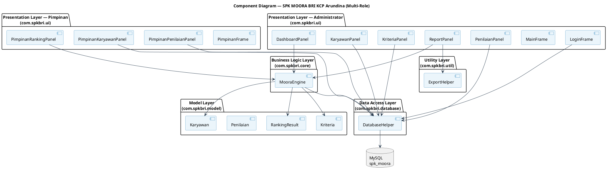

## 13. Flowchart Sistem yang Berjalan (Gambar 3)

```plantuml
@startuml FlowchartSistemBerjalan
skinparam Style strictuml
skinparam activity {
  BackgroundColor #FADBD8
  BorderColor #C0392B
  ArrowColor #2C3E50
}

|admin|
start
:mulai|
:buat akun juri]
:input Fakultas dan Prodi/
:input Kategori & Subkategori/
:buat form penilaian/

|sistem|
database database as db

|admin|
:buat akun juri] --> db
:input Fakultas dan Prodi/ --> db
:input Kategori & Subkategori/ --> db
:buat form penilaian/ --> db

|juri|
:masuk akun]
:input penilaian/

|sistem|
|juri|
:input penilaian/ --> |sistem| db

|juri|
:data penilaian]
|sistem|
db --> |juri| :data penilaian]

|admin|
:rekapitulasi penilaian setiap juri|
|juri|
:data penilaian] --> |admin| :rekapitulasi penilaian setiap juri|

|admin|
:rekapitulasi penilaian setiap juri| --> :data rekapitulasi]
:data rekapitulasi] --> :selesai|
stop
@enduml
```

---

## 14. Flowchart Sistem yang Akan Dikembangkan (Gambar 4)

```plantuml
@startuml FlowchartSistemAkanDikembangkan
skinparam Style strictuml
skinparam activity {
  BackgroundColor #EBF5FB
  BorderColor #2980B9
  ArrowColor #2C3E50
}

|admin|
start
:mulai|
:buat akun juri]
:input Fakultas dan Prodi/
:input Kategori & Subkategori/
:buat form penilaian/

|sistem|
database database as db

|admin|
:buat akun juri] --> db
:input Fakultas dan Prodi/ --> db
:input Kategori & Subkategori/ --> db
:buat form penilaian/ --> db

|juri|
:masuk akun]
:input penilaian/

|sistem|
:metode moora|
|juri|
:input penilaian/ --> |sistem| :metode moora|

|sistem|
:metode moora| --> :penjumlahan matriks keputusan|
:penjumlahan matriks keputusan| --> :normalisasi matriks keputusan|
:normalisasi matriks keputusan| --> :normalisasi matriks keputusan berbobot|
:normalisasi matriks keputusan berbobot| --> :hasil perhitungan moora|
:hasil perhitungan moora| --> db

|juri|
:data penilaian]
|sistem|
db --> |juri| :data penilaian]

|admin|
:rekapitulasi penilaian setiap juri|
|juri|
:data penilaian] --> |admin| :rekapitulasi penilaian setiap juri|

|admin|
:rekapitulasi penilaian setiap juri| --> :data rekapitulasi]
:data rekapitulasi] --> :selesai|
stop
@enduml
```

---

## Catatan Penggunaan

Untuk merender diagram, gunakan salah satu:

1. **VS Code** — Install ekstensi `PlantUML` (jebbs), tekan `Alt+D` untuk preview
2. **PlantUML Online** — https://www.plantuml.com/plantuml/uml/
3. **IntelliJ IDEA** — Install plugin `PlantUML Integration`

---

## Daftar Diagram

| No | Nama Diagram | Jenis | Kegunaan di Skripsi |
|---|---|---|---|
| 1 | Use Case Diagram (Multi-Role) | UML Behavioral | Bab 3 — Analisis Kebutuhan |
| 2 | Activity Diagram Login + Role Routing | UML Behavioral | Bab 3 / Bab 4 |
| 3 | Activity Diagram Kelola Karyawan (Admin) | UML Behavioral | Bab 3 / Bab 4 |
| 4 | Activity Diagram Input Penilaian (Admin & Pimpinan) | UML Behavioral | Bab 3 / Bab 4 |
| 5 | Activity Diagram Kalkulasi MOORA | UML Behavioral | Bab 3 / Bab 4 |
| 6 | Sequence Diagram Login + Routing | UML Behavioral | Bab 4 — Implementasi |
| 7 | Sequence Diagram Kalkulasi MOORA | UML Behavioral | Bab 4 — Implementasi |
| 8 | Sequence Diagram Input Penilaian (Pimpinan) | UML Behavioral | Bab 4 — Implementasi |
| 9 | Class Diagram (Multi-Role) | UML Structural | Bab 3 / Bab 4 |
| 10 | ERD (dengan kolom role) | Database Design | Bab 3 — Perancangan Database |
| 11 | Deployment Diagram | UML Structural | Bab 4 — Implementasi |
| 12 | Component Diagram (Multi-Role) | UML Structural | Bab 3 / Bab 4 |
| 13 | Flowchart Sistem yang Berjalan | Flowchart | Bab 3 / Bab 4 |
| 14 | Flowchart Sistem yang Akan Dikembangkan | Flowchart | Bab 3 / Bab 4 |

